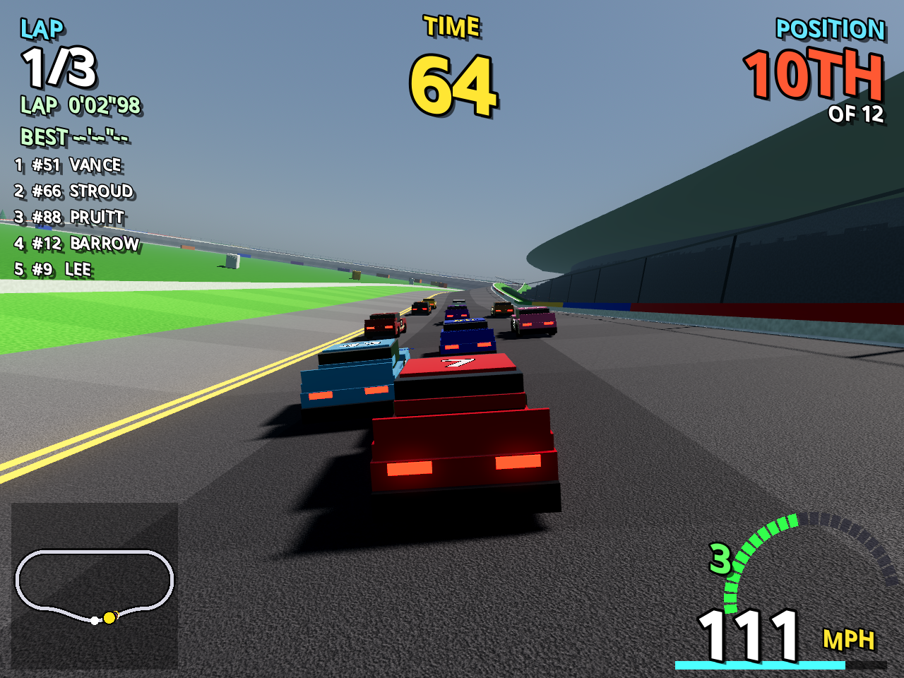
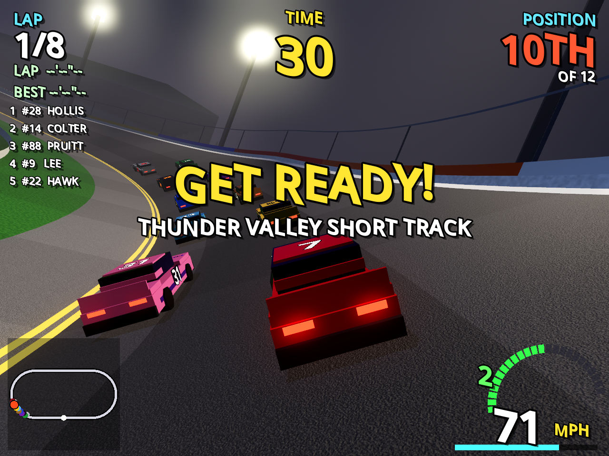
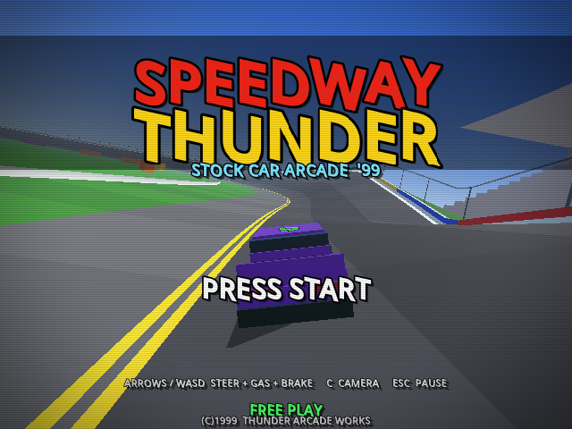
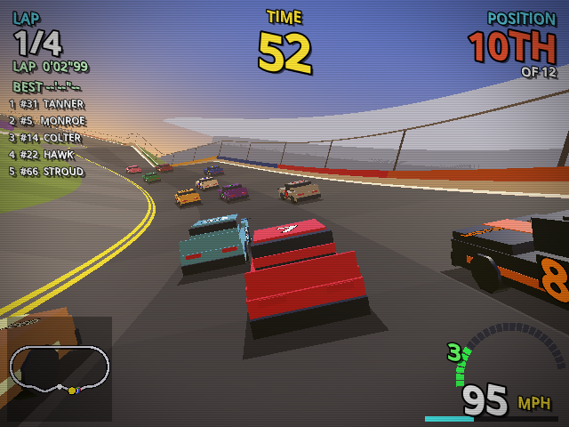

# Speedway Thunder '99

Modern mode:

 

1999 mode:

 

A stock car racing game built in **Godot 4.3**. It has the feature set of the classic
NASCAR console games of the early 2000s, with racing modelled on 2026 Next Gen Cup cars.
It also keeps its roots as a 1999 arcade cabinet racer.

Everything is generated at runtime: tracks, grandstands, cars, the HUD and the synth
audio. The project has no imported assets.

### Two graphics modes (F3 to switch)

- **Modern** (the default) is the realistic look:
  - a sculpted Next Gen style car with a two-tone livery, glass, splitter, spoiler and
    single-lug wheels; the body dents where it's hit;
  - procedurally generated asphalt, grass and concrete textures with normal maps;
  - grandstands full of fans, pine and broadleaf trees and a chain-link catch fence;
  - a procedural sky with clouds (stars at night), sun shadows and bloom;
  - on desktop (Forward+): ambient occlusion, screen-space reflections, volumetric fog
    with light-tower beams at night, and FSR 2 upscaling with temporal anti-aliasing.
  Options → Quality picks LOW / MEDIUM / HIGH / ULTRA, or AUTO, which lowers detail
  when frames run late. The browser build runs Modern with lighter effects.
- **1999** is the original look: 640×480 upscaled, vertex colours, boxy cars, blob
  shadows and CRT scanlines (F2).

Motion is smooth on any refresh rate: cars are drawn between physics steps (Options →
Motion smoothing), and Options → VSync off gives the lowest input delay.

## Game modes

| Mode | What it is |
|---|---|
| **Arcade** | The 1999 cabinet game: 16 cars, a short race and a countdown clock with EXTENDED TIME each lap. |
| **Single Race** | A full race weekend (practice, qualifying, race) with 20–40 cars and the full rules below. |
| **Season** | A 6-, 12- or 36-race championship with points, wins and top 5s. Standings are saved between sessions. |
| **Career** | Rookie to champion. Start underfunded, then earn prize money and reputation, sign sponsors and buy engine, aero, chassis and pit-crew R&D. It runs season after season with a career record. |
| **2 Player** | Split-screen racing. Player 2 uses I/J/K/L (U to pit) or a second gamepad. |
| **Lightning Challenges** | Eight race-defining scenarios, such as a last-lap draft, a charge from the back or saving fuel. Completing five unlocks the #00 Thunderbolt legend car. |
| **Paint Shop** | Create your own car: number, driver name, sponsor and colours. You can race it in every mode. |

## Racing: how it models 2026 Next Gen racing

- **Car physics.** Each car is a rigid body on the banked track, with:
  - tyres that have a grip peak and fall-off, and grip that changes with load;
  - downforce and drag;
  - a 5-speed sequential gearbox;
  - fuel burn and tyre wear.

  Cars can get loose or tight, spin, and wreck.
- **Power.** Gen-3 style, unrestricted 950 hp everywhere:
  - superspeedways run tall gears and trimmed drag: about 208–212 mph alone and
    215–220 mph in the draft;
  - everywhere else the cars carry more drag and downforce, so they're quick off
    the corners but top out around 180–195 mph.
- **Drafting.**
  - Superspeedways: pack drafting worth about 9 mph that builds through a line of cars. A car on your bumper pushes you, and a car alongside your rear quarter slows you down (side-drafting).
  - Other tracks: the draft is smaller, and a car close behind another loses front downforce in its dirty air and pushes up the track.
- **Contact and wrecks.** Car-to-car and wall contact is resolved as physical impulses at the contact point:
  - A tap in the right rear can hook a car into a spin.
  - Pack wrecks collect several cars.
  - Damage reduces aero, power and alignment, and heavy damage retires the car.
- **Race rules.**
  - **Cautions:** the pace car comes out and scoring freezes. The field slows and forms single file, and wrecked cars are towed off.
  - **Pit road:** opens after a lap under caution. The free pass (lucky dog) and wave-arounds apply.
  - **Restarts:** "one to go", then double-file restarts with the choose rule.
  - **Stages:** stage points go to the top 10 at the end of each stage.
  - **Finish:** overtime (green-white-checkered), and a caution on the final lap ends the race.
- **Pit stops.** Choose 4 tyres, 2 tyres or fuel only; stops also repair damage. Pit road is driven automatically, and the AI runs its own pit strategy.
- **Spotter.** Callouts for car high, car low, three wide and clear.
- **Garage.** Adjust handling balance (tight or loose), tyre pressure (grip versus wear) and gearing.
- **Replays.** After any race, press R to watch it with TV, chase, bumper or helicopter cameras.

## Tracks (11, all fictional)

| Track | Type |
|---|---|
| Thunder Beach | 2.1-mile tri-oval superspeedway, 31° banking |
| Big Sky | 2.6-mile superspeedway, 33° banking |
| Lone Star | 1.4-mile quad-oval, sunset |
| Gulf Coast | 1.6-mile oval at dusk |
| Motor City | 2.3-mile D-oval |
| Keystone Triangle | 2.8-mile triangle, a different banking in each corner |
| Palmetto | 1.2-mile egg-shaped oval |
| Desert Sun | 1.3-mile dog-leg oval |
| Thunder Valley | 0.5-mile high-banked night short track |
| Magnolia | 0.5-mile flat paperclip |
| Canyon Ridge | 3.2-mile road course with left and right turns |

## Running

**Windows, no install:** download
[`downloads/SpeedwayThunder-windows.zip`](downloads/SpeedwayThunder-windows.zip),
unzip it and double-click `SpeedwayThunder.exe`. The exe isn't code-signed, so Windows
SmartScreen may warn you: click **More info → Run anyway**.

**Any platform, from source:**

1. Install [Godot 4.3+](https://godotengine.org/download). The standard build is fine; you don't need .NET. The full Modern effects need a Vulkan (or Direct3D 12) capable GPU; on older machines, launch with `godot --path . --rendering-method gl_compatibility` for the lighter version.
2. Open `project.godot` in the editor and press **F5**, or run from the command line:
   ```sh
   godot --path .
   ```

### Web build

`export_presets.cfg` has a **Web** preset. It is single-threaded, so it runs on ordinary
static hosting without cross-origin isolation headers. Install the Godot 4.3 export
templates, then run:
```sh
godot --headless --path . --export-release Web build/web/index.html
```

## Controls

| Action | Keyboard | Gamepad |
|---|---|---|
| Steer | ← → / A D | Left stick / D-pad |
| Gas | ↑ / W / Z | RT / A |
| Brake / reverse | ↓ / S / X | LT / B |
| Start / select | Enter / Space | Start / A |
| Back (menus) | Backspace | B |
| Change camera | C | Y |
| Pause | Esc / P | Back |
| Quit race (while paused) | Q | — |
| Pit this lap / change pit plan (Single Race, Season, Career) | Tab / O | X / D-pad up |
| Choose restart lane at "one to go" | ← / → | Left stick |
| Shift up / down (manual gearbox) | E / Q | RB / LB |
| Watch replay (results screen) | R | Right stick click |
| Graphics: Modern / 1999 | F3 | — |
| Toggle scanlines (1999 mode) | F2 | — |
| Fullscreen | F11 | — |

## Project layout

```
project.godot              Forward+ on desktop, Compatibility on web; 640x480 base UI
scenes/main.tscn           single scene; everything else is built in code
scripts/game.gd            autoload: tracks, teams, input, settings, season, career,
                           paint shop, challenges, records, retro/modern materials
scripts/main.gd            state machine, menus, race weekends, cameras, replays, split screen
scripts/menu.gd            reusable arcade-style list menu
scripts/track.gd           track builder (ovals + segment layouts), banking, pit road,
                           AI speed profile, meshes and scenery
scripts/car.gd             Next Gen car: rigid-body physics on the banked surface, tyres,
                           gearbox, damage, fuel/wear, assists, model
scripts/race.gd            field, AI drivers, drafting / dirty air, contact, laps, recording
scripts/race_control.gd    flags, cautions, pace car, pit stops, restarts, stages, points
scripts/hud.gd             HUD (scales to any view size, used twice in split screen)
scripts/audio.gd           AudioStreamGenerator software synth
tests/                     headless test benches and screenshot scripts (see below)
```

### How the physics works

Each car's position is kept in *track space*: distance along the centre line and offset
across the track. Its heading, body-frame velocities and yaw rate are then integrated like
a real vehicle:
- **Tyres:** front and rear forces from slip angles, using a Pacejka-style curve inside a
  friction circle, with load sensitivity.
- **Banking:** the banked surface adds normal load, its slope pulls the car toward the
  inside, and the turn curves less within the tilted road plane.
- **Aero:** downforce and drag, adjusted by the cars around you.

The AI and the optional player assists steer by requesting a yaw rate, which lets them
catch small slides. Hard hits switch that help off, so real wrecks still happen.

## Tests

All tests run headless (`godot --headless --fixed-fps 60 --path . -s <script>`):

| Script | What it checks |
|---|---|
| `tests/smoke_test.gd` | Arcade game flow on every track |
| `tests/physics_test.gd` | Solo lap speeds, draft gain and a 40-car race per track |
| `tests/field_test.gd` | Full-field AI race with incident tracing (`TRACK=n SECS=s TRACE=car#`) |
| `tests/rules_test.gd` | A full rules race: cautions, pits, stages and points |
| `tests/race_mode_test.gd` | Single Race through the real game flow |
| `tests/weekend_test.gd` | Practice → qualifying → race, plus a season round |
| `tests/career_test.gd` | Career money, R&D, season rollover |
| `tests/challenge_test.gd` | Every Lightning Challenge reaches a verdict |
| `tests/tracks_test.gd` | Every track builds and laps cleanly |
| `tests/split_shots.gd` | Two-player race (screenshot with `OUT=dir` and a renderer) |

`tests/screenshots.gd`, `tests/menu_shots.gd` and `tests/replay_shots.gd` capture
screenshots when run with a renderer (for example under `xvfb-run`).
`tests/screenshots_modern.sh` does the same with the Forward+ renderer.

In headless mode, Godot's dummy renderer prints `mesh_get_surface_count` errors.
They're harmless and don't appear with a real renderer.

## Notes

All team names, drivers, sponsors and tracks are fictional. The title lives in
`scripts/game.gd` (`TITLE` / `SUBTITLE`) and in the title screen in `scripts/main.gd`
if you want to rename the game.
